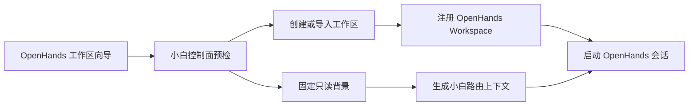
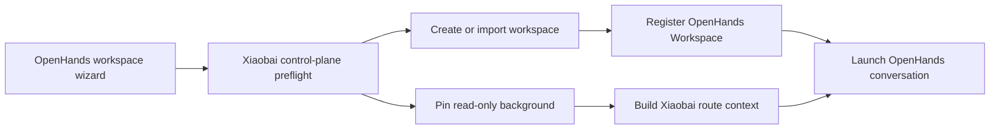

# Xiaobai on OpenHands / 在 OpenHands 中运行小白

## 中文

### 目标

这个目录把小白控制面、小能背景和 Obsidian 记忆接入基于 OpenHands `v1.7.1` 的可视化开发工具。OpenHands 保持为独立薄分支，只增加工作区页面和集成层；小白与小能仍是独立仓库，默认包不包含七个 T-MAX 业务代码仓。

创建流程：



运行边界：

- 小白编排器：`/projects/xiaobai`，读写，使用独立 runtime Git 工作副本。
- 托管工作区：宿主机 `runtime/workspaces/`，容器内 `/projects/`，读写。
- 项目背景：宿主机 `runtime/backgrounds/`，容器内 `/backgrounds/`，Agent 只读。
- 小能：同时暴露为 `/backgrounds/xiaoneng` 与兼容路径 `/opt/xiaoneng`，固定为 `versions.lock` 中的提交。
- 控制面状态：`runtime/state/control-plane/`，不挂载给 Agent。
- Obsidian：`/memory/obsidian`，读写，保存接收方自己的持久记忆。
- OpenHands 状态：`/home/openhands/.openhands`，持久化到 `runtime/state/openhands/`。

### 前置条件

- Docker Desktop 或 Docker Engine。
- Docker Compose v2。
- Git。
- 可访问已配置模型的网络和 API Key。

源代码仓不要求宿主机安装 Node.js；控制面编译和工作区初始化都在 Docker 中执行。首次启动会从固定提交构建定制 Canvas 与控制面镜像，后续启动复用按提交号标记的镜像。

### 配置

```bash
cp deploy/openhands/.env.example deploy/openhands/.env
```

至少填写：

```dotenv
LLM_API_KEY=your-key
LLM_MODEL=provider/model
```

真实 Key 只能留在 ignored 的 `.env` 或进程环境中。不要把它写入 `compose.yaml`、`versions.lock`、Git bundle 或文档。

`OBSIDIAN_VAULT_PATH` 留空时使用 runtime 下的新空 Vault。若指定已有 Vault，启动器只在以下项目目录中初始化缺失文件，不覆盖已有内容：

```text
88-学习/xiaobai/10-项目记忆/xbaiProjectCode
```

### 从源码生成分发包

小白 `OpenHands` 和小能 `xiaoneng2.0` 必须都处于干净、已提交状态：

```bash
./deploy/openhands/package.sh \
  --openhands /path/to/openHands \
  --xiaoneng /path/to/xiaoneng
```

脚本在 ignored 的 `dist/` 下生成：

```text
xiaobai-openhands-<fingerprint>/
├── artifacts/
│   ├── xiaobai.bundle
│   ├── xiaoneng.bundle
│   └── openhands.bundle
├── deploy/openhands/
├── SHA256SUMS
└── runtime/                 # 首次启动时创建
```

同时生成同名 `.tar.gz`。指纹由 OpenHands、小白、小能三个提交共同计算；包中只包含已提交状态，任何未提交改动都会阻断打包。

三个 Git bundle 都是无历史的分发快照。resolved `versions.lock` 同时记录 OpenHands、小白、小能的来源提交和快照提交；小白现有 `workspace/memory/loops/**`、本机路径报告和个人 Obsidian Vault 不进入快照。

### 打包为 macOS 应用

已有 `.tar.gz` 分发包后，可以再封装成可双击的 macOS 应用：

```bash
./deploy/openhands/package-app.sh \
  --package dist/xiaobai-openhands-<fingerprint>.tar.gz
```

脚本在 ignored 的 `dist/` 下生成：

```text
tiny白.app
xiaobai-openhands-<fingerprint>-macOS.zip
```

应用打开后会启动本机服务，并在独立的 macOS 窗口中显示 Canvas；不会默认跳转到 Chrome/Safari 的地址栏页面。应用菜单中提供“重新连接/启动”“配置模型”“在浏览器中打开”和“停止服务”四个操作，其中“在浏览器中打开”仅作为排障或偏好浏览器使用时的备用入口。应用内只携带已经校验的无凭据分发包；首次运行时才在当前用户的以下目录中创建权限为 `600` 的模型配置和持久化 runtime：

```text
$HOME/Library/Application Support/tiny白
```

应用的新配置默认使用 Canvas 端口 `8001` 和控制面端口 `18003`，与源码运行模式默认的 `8000` / `18002` 分离。启动器会在创建容器前检查两个端口，并在重试时清理由应用自己的失败容器；它不会停止源码模式的 Compose 实例。

接收方仍需安装 Docker Desktop。打包 `.app` 需要 macOS 与 Xcode Command Line Tools，因为脚本会编译一个轻量的原生 WebKit 窗口壳。当前应用使用 ad-hoc 签名，没有 Apple Developer ID 签名和公证；其他 Mac 首次打开时可能需要在 Finder 中右键应用并选择“打开”。不要通过修改应用包来保存模型 Key，应该始终使用应用菜单中的“配置模型”。

### 启动与停止

接收方解压后执行：

```bash
cp deploy/openhands/.env.example deploy/openhands/.env
./deploy/openhands/run.sh
```

访问：`http://localhost:8000/canvas`。浏览器使用仅绑定到本机的控制面：`http://127.0.0.1:18002`。

停止但保留工作区、OpenHands 状态和 Obsidian 记忆：

```bash
./deploy/openhands/stop.sh
```

### 体检

```bash
./deploy/openhands/doctor.sh
```

体检覆盖定制 Canvas 版本、控制面健康状态、Git 版本、工作区读写与背景只读挂载、容器记忆路径、`t-max -> xiaoneng` 路由、凭据/个人路径扫描、包校验和和运行时权限验证。

同一个 Obsidian 项目目录只允许一个 OpenHands 写入实例。`run.sh` 使用 `.xiaobai-writer.lock` 阻止并发写入；正常停止会释放锁，记忆文件不会删除。

### 更新边界

- 更新小白：在 `OpenHands` 分支完成并提交，再重新打包。
- 更新小能：先在小能仓提交并验证，再更新 `versions.lock` 的 `XIAONENG_COMMIT`。
- 更新 OpenHands：在独立薄分支完成兼容验证，再同时更新 `OPENHANDS_VERSION`、Agent Server/Automation 版本锁和源码提交。
- 默认包不携带个人 Vault、模型密钥、SSH 配置、本机软链接或七个 T-MAX 业务仓。

## English

### Purpose

This directory connects the Xiaobai control plane, Xiaoneng background, and Obsidian memory to a visual development tool based on OpenHands `v1.7.1`. OpenHands remains an independent thin fork containing only the workspace UI and integration layer. Xiaobai and Xiaoneng remain separate repositories, and the default package excludes the seven T-MAX business repositories.

Creation flow:



Runtime boundaries:

- Xiaobai orchestrator: `/projects/xiaobai`, writable, using an isolated runtime Git checkout.
- Managed workspaces: host `runtime/workspaces/`, container `/projects/`, writable.
- Project backgrounds: host `runtime/backgrounds/`, container `/backgrounds/`, read-only to agents.
- Xiaoneng: exposed at `/backgrounds/xiaoneng` and the compatibility path `/opt/xiaoneng`, pinned to `versions.lock`.
- Control-plane state: `runtime/state/control-plane/`, never mounted into the agent runtime.
- Obsidian: `/memory/obsidian`, writable, storing the recipient's persistent memory.
- OpenHands state: `/home/openhands/.openhands`, persisted under `runtime/state/openhands/`.

### Prerequisites

- Docker Desktop or Docker Engine.
- Docker Compose v2.
- Git.
- Network access and an API key for the selected model.

The host does not need Node.js. Control-plane compilation and workspace initialization run in Docker. The first start builds customized Canvas and control-plane images from pinned commits; later starts reuse commit-tagged images.

### Configuration

```bash
cp deploy/openhands/.env.example deploy/openhands/.env
```

Set at least:

```dotenv
LLM_API_KEY=your-key
LLM_MODEL=provider/model
```

Real keys belong only in the ignored `.env` or process environment. Never put them in `compose.yaml`, `versions.lock`, Git bundles, or documentation.

When `OBSIDIAN_VAULT_PATH` is empty, the launcher creates an isolated empty vault under runtime. When an existing vault is selected, setup initializes only missing files under this project directory and never overwrites existing content:

```text
88-学习/xiaobai/10-项目记忆/xbaiProjectCode
```

### Build a Distribution from Source

Both Xiaobai `OpenHands` and Xiaoneng `xiaoneng2.0` must be clean and committed:

```bash
./deploy/openhands/package.sh \
  --openhands /path/to/openHands \
  --xiaoneng /path/to/xiaoneng
```

The script creates an ignored `dist/` output containing:

```text
xiaobai-openhands-<fingerprint>/
├── artifacts/
│   ├── xiaobai.bundle
│   ├── xiaoneng.bundle
│   └── openhands.bundle
├── deploy/openhands/
├── SHA256SUMS
└── runtime/                 # created on first start
```

A matching `.tar.gz` is created as well. Its fingerprint is derived from the OpenHands, Xiaobai, and Xiaoneng commits. Only committed state is packaged; any uncommitted change blocks packaging.

All three Git bundles are history-free distribution snapshots. The resolved `versions.lock` records source and snapshot commits for OpenHands, Xiaobai, and Xiaoneng. Existing Xiaobai `workspace/memory/loops/**`, machine-path reports, and personal Obsidian vault content are excluded.

### Package as a macOS Application

After producing the `.tar.gz` distribution, wrap it as a double-clickable macOS application:

```bash
./deploy/openhands/package-app.sh \
  --package dist/xiaobai-openhands-<fingerprint>.tar.gz
```

The script creates ignored outputs under `dist/`:

```text
tiny白.app
xiaobai-openhands-<fingerprint>-macOS.zip
```

The application starts the local service and shows Canvas inside an independent macOS window instead of opening the user's default browser. Its application menu keeps four actions: Reconnect/Start, Configure Model, Open in Browser, and Stop Service; Open in Browser is a fallback for troubleshooting or browser-preference workflows. It embeds only the verified credential-free distribution. On first launch, it creates the mode-`600` model configuration and persistent runtime under the current user's directory:

```text
$HOME/Library/Application Support/tiny白
```

New application configurations default to Canvas port `8001` and control-plane port `18003`, separate from the source defaults `8000` / `18002`. Before creating containers, the launcher checks both ports and cleans up only its own failed application containers on retries; it never stops the source-mode Compose instance.

Recipients still need Docker Desktop. Building the `.app` requires macOS and Xcode Command Line Tools because the wrapper script compiles a lightweight native WebKit window. The current application is ad-hoc signed, not signed and notarized with an Apple Developer ID. On another Mac, the first launch may require right-clicking the application in Finder and choosing Open. Never store model keys by modifying the application bundle; always use the Configure Model action.

### Start and Stop

After extracting the package:

```bash
cp deploy/openhands/.env.example deploy/openhands/.env
./deploy/openhands/run.sh
```

Open `http://localhost:8000/canvas`. The browser uses the loopback-only control plane at `http://127.0.0.1:18002`.

Stop while preserving workspaces, OpenHands state, and Obsidian memory:

```bash
./deploy/openhands/stop.sh
```

### Doctor

```bash
./deploy/openhands/doctor.sh
```

The doctor checks the customized Canvas version, control-plane health, Git versions, writable workspace and read-only background mounts, container-only memory paths, `t-max -> xiaoneng` routing, credential and personal-path scans, package checksums, and live access enforcement.

Only one OpenHands writer may use an Obsidian project directory at a time. `run.sh` creates `.xiaobai-writer.lock` to prevent concurrent writes. A normal stop releases the lock without deleting memory.

### Update Boundary

- Update Xiaobai on the `OpenHands` branch, commit it, and package again.
- Update Xiaoneng in its own repository, verify the commit, then update `XIAONENG_COMMIT` in `versions.lock`.
- Update OpenHands on the independent thin fork, complete compatibility verification, then update `OPENHANDS_VERSION`, Agent Server/Automation locks, and source commit together.
- The default package excludes personal vaults, model keys, SSH configuration, machine symlinks, and the seven T-MAX business repositories.
